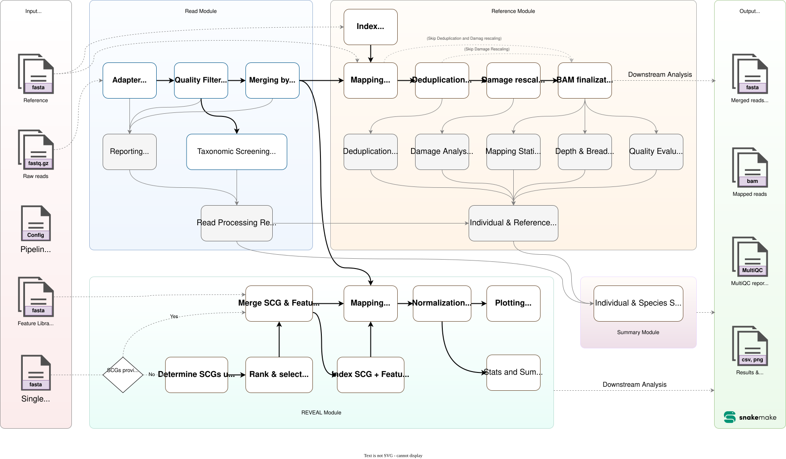

<p align="center"></p>

# pastForward - A pipeline for ancient and historical DNA based on Snakemake

[](https://snakemake.github.io)
[](https://github.com/SarahSaadain/aDNA_Pipeline_Snakemake/releases)
[](LICENSE)

pastForward analyzes raw ancient and historical DNA from a sequencing facility. It checks read quality and screens for contamination, using checks suited to the short, damaged reads typically seen in ancient and historical DNA. It maps reads to a reference genome and corrects them for DNA damage, so they're ready for downstream analysis. Optionally, it can also compare key genomic features (e.g. across time points or between specimen), such as transposon insertions, gene copy number changes, or endosymbiont strain replacements.

pastForward is built on [Snakemake](https://snakemake.github.io). For more information on Snakemake itself, see the [Snakemake website](https://snakemake.github.io).


> **Note:** pastForward integrates two purpose-built tools for its core analyses: [REVEAL](https://github.com/SarahSaadain/REVEAL) for transposable element and genomic feature dynamics, and [ECMSD](https://github.com/capoony/ECMSD) for contamination screening against a curated mitochondrial database. See their READMEs for details on each tool.

## Workflow Overview

Below is an overview of the steps of the pipeline:



For detailed information about the processing steps, see the [Process Overview](docs/process_overview.md) page. For common questions and troubleshooting, see the [FAQ](docs/FAQ.md).

## Quick Start

New to pastForward? Here's the whole path, start to finish. Each step links to more detail if you need it.

1. **Install Conda and Snakemake, and download pastForward.** The [Setup Guide](config/README.md) walks through this step by step.
2. **Add your species and sequencing data.** Also covered in the [Setup Guide](config/README.md#step-4-add-your-species-and-data), including how your read files need to be named.
3. **Create a `config.yaml` file.** Every pipeline stage is turned on by default, but can be adjusted if required. To run with default settings,only a minimal config with a project name and species list is required. If you want to adjust the config, but rather not edit a text file by hand, open [config/config_designer.html](config/config_designer.html) in your browser to create your config.
4. **Run the pipeline.** See [Running the Pipeline](#running-the-pipeline) below for the exact command.

## Running the Pipeline

Run `./pastForward` from your **project folder**, the folder that directly contains `workflow/`, `config/`, and your `<species>/` folders. See [Project Structure](config/README.md#project-structure) for what that folder should look like.

For a new project, run these in order:

1. **`./pastForward check`** — see what pastForward finds on disk for your config (species/individuals/references/...). Fix your data or config first if anything looks wrong here.
2. **`./pastForward preview`** — see the output files a run would produce, including ones it'll skip.
3. **`./pastForward dryrun`** *(optional)* — a full Snakemake dry run, to double-check the exact rules that would execute.
4. **`./pastForward run --cores 40`** — runs the pipeline, in the background by default.

```bash
./pastForward check
./pastForward preview
./pastForward dryrun            # optional

./pastForward run --cores 40             # runs the pipeline, in the background, with the suggested flags
./pastForward run --cores 40 --fg        # same, but in the foreground
./pastForward resume --cores 40          # like run, but also picks back up rules left incomplete by a crash/kill

./pastForward status           # PID, progress %, and the last few pipeline steps of the tracked background run
./pastForward status --live    # same, then tails the log (Ctrl-C to stop)
./pastForward status --watch   # same, but reprints every 5s until the run ends (Ctrl-C to stop early)
./pastForward abort            # stop it gracefully (SIGTERM; snakemake shuts down its own subprocesses)
./pastForward abort --force    # or kill it and everything it started, immediately
./pastForward unlock           # clear a stale lock left by a crashed run
./pastForward print-log        # print the most recently written log from logs/

./pastForward version          # print the pipeline version
```

`run` requires `--cores <N>` (or `-j`/`--jobs`) — pastForward won't guess a thread count for you. `--use-conda`, `--keep-going`, and `--rerun-trigger mtime` are added automatically, but any of those you pass yourself are used instead of the default; any other extra arguments (e.g. `--forceall`) are passed straight through to Snakemake. `run` also refuses to start if a tracked run is still alive in the same project folder — `abort` it first.

Each `run`/`dryrun` writes a timestamped log to `logs/` in your project folder; `status` reads the most recent `run` back out of there.

Snakemake keeps track of what's already been done and only re-runs steps that are missing or out of date. To start completely over, delete the relevant `results` and `processed` folders and run the pipeline again.

Want to call `snakemake` directly, tune its flags, run without the CLI wrapper, or run on an HPC cluster? See [Running with Snakemake](docs/snakemake.md).

## Reports

pastForward generates a MultiQC report for:

* **Each species** (all samples from that species together, so you can compare results across them)
  * Location: `{species}/results/summary_module/species_level/{species}_multiqc.overall.html`
* **Each individual sample**
  * Location: `{species}/results/summary_module/individual_level/{individual}_multiqc.html`

These reports summarize reads before and after trimming, contamination analysis, coverage, deduplication, and damage rescaling. Use them to judge the quality of your sequenced reads and decide whether a sample needs additional library preparation.